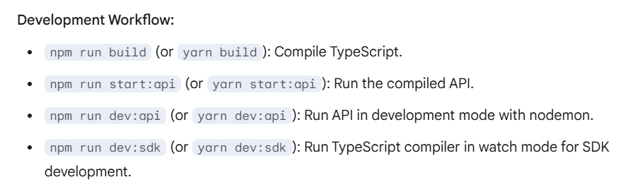

# SolAsk

SolAsk is a developer-first SDK designed for natural language search of Solana dApps. It provides tools and utilities to interact with Solana blockchain data and integrates with LLMs (Large Language Models) for natural language processing.

## Features

- **Solana Integration**: Interact with Solana blockchain data using the SDK.
- **Natural Language Processing**: Leverage LLMs for natural language queries.
- **Developer-Friendly**: Includes utilities and core logic for easy integration into your projects.

## Project Structure

SolAsk
├── dist/             # Compiled JavaScript and type definitions
├── src/
│   ├── index.ts        # SDK entry point
│   ├── sdk/            # SDK core logic
│   │   ├── core.ts
│   │   └── utils.ts
│   ├── api/            # API backend
│   │   ├── controllers/
│   │   │   └── query.controller.ts
│   │   ├── routes/
│   │   │   └── query.routes.ts
│   │   └── server.ts
│   ├── llm/            # LLM interaction
│   │   └── llmService.ts
│   ├── solana/         # Solana data interaction
│   │   └── solanaService.ts
│   ├── types/          # Shared types
│   │   └── index.ts
├── .env              # Environment variables (DO NOT COMMIT)
├── .gitignore
├── package.json
├── tsconfig.json
├── README.md
└── LICENSE


## Prerequisites

Before setting up the project, ensure you have the following installed:

- **Node.js** (v16 or later)
- **npm** (v8 or later)
- **TypeScript** (installed globally or as a dev dependency)

## Setup Instructions

1. **Clone the Repository**:
   ```bash
   git clone https://github.com/susmitasanti/SolAsk.git
   cd SolAsk


## Different types of Data that is to be retrieved

Okay, to make your fetchSolanaData function cleaner and more modular, let's break down the types of data you might want to retrieve and present to the user based on their natural language queries. Here's a categorized list to help you create separate function calls:

I. Account Information:

1. Basic Account Details:
   - Account Balance (in SOL).
   - Account Owner (the program that owns the account).
   - Is the account executable?
   - Account data size.
   - Rent Exemption status.

2. Token Account Information (SPL Tokens & NFTs):
   - Token Balance (for a specific mint).
   - Token Mint Address.
   - Token Account Owner.
   - Token Account Delegate (if any).
   - Delegate Authority.
   - Is the account frozen?
   - Associated Token Account (ATA) address for a given wallet and mint.

3. Program Account Information:
   - Program ID.
   - Executable data.
   - Program data size.
   - Accounts owned by this program (requires getProgramAccounts).

4. Stake Account Information:
   - Staked SOL amount.
   - Staking authority.
   - Withdraw authority.
   - Delegated vote account.
   - Stake activation/deactivation status.
   - Rewards earned.

5. Vote Account Information:
   - Voter list.
   - Last vote slot.
   - Activated stake.
   - Commission.


II. Transaction Information:

1. Basic Transaction Details:
   - Transaction Signature.
   - Block Time.
   - Slot.
   - Fee paid.
   - Transaction status (success/failure).
   - Account Keys involved in the transaction.

2. Parsed Transaction Instructions:
   - Program invoked.
   - Instruction type (e.g., transfer, mint, burn, stake, vote).
   - Parameters/arguments of the instruction (e.g., amount, sender, receiver, mint address).
   - Inner instructions (for CPI - Cross-Program Invocation).
   - Transaction logs.

3. Transaction History for an Account:
   - List of transaction signatures involving a specific address (sent or received).
   - Details of each transaction in the history.


III. Block Information:

1. Basic Block Details:
   - Block Height.
   - Block Hash.
   - Previous Block Hash.
   - Block Time.
   - Number of transactions in the block.
   - Transaction signatures in the block.
   - Rewards in the block.

IV. Program Information:

1. Program Details:
   - Program ID.
   - Accounts owned by the program (using getProgramAccounts).
   - Deployed bytecode (if needed, though complex to interpret).

2. Program Derived Addresses (PDAs):
   - Ability to identify PDAs related to a specific program and seed.


V. Token and NFT Information (Beyond Account Balances):

1. Token Metadata (for SPL Tokens and NFTs):
   - Name.
   - Symbol.
   - Decimals.
   - URI (for NFTs, pointing to metadata).
   - Creators.
   - Update authority.

2. Token Supply:
   - Total supply of a given mint.
   - Circulating supply.

3. Largest Token Holders:
   - Accounts with the largest balances of a specific token.

VI. Network Information:

1. Cluster Information:
   - Network (mainnet-beta, devnet, testnet).
   - Current slot.
   - Epoch information.
   - Inflation rate.

2. Validator Information:
   - List of active validators.
   - Validator stake.
   - Validator vote accounts.


